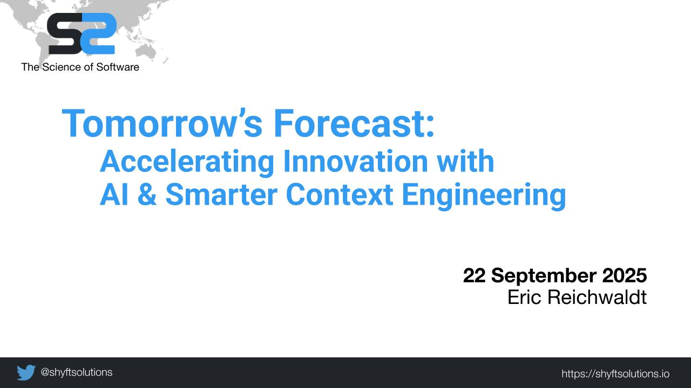
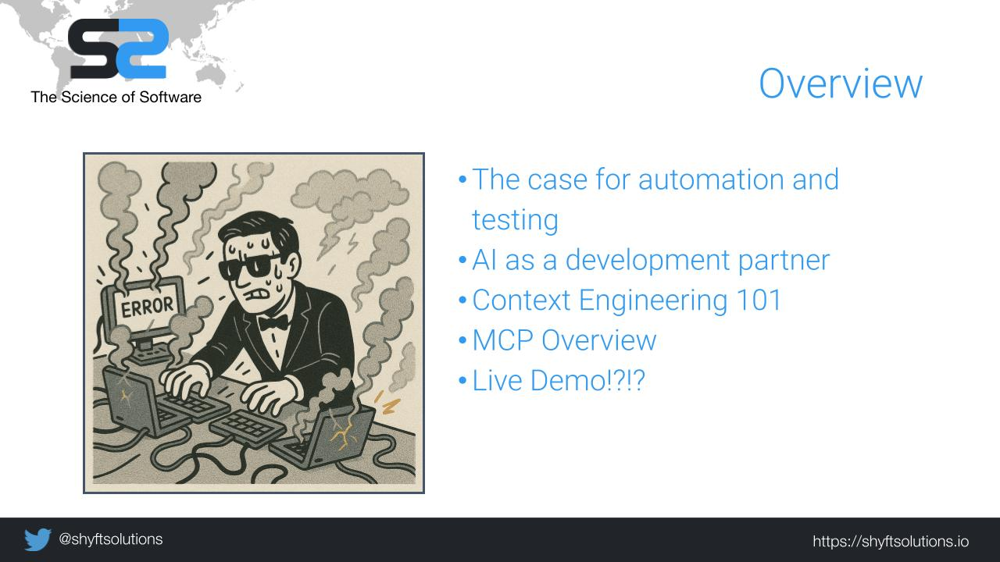
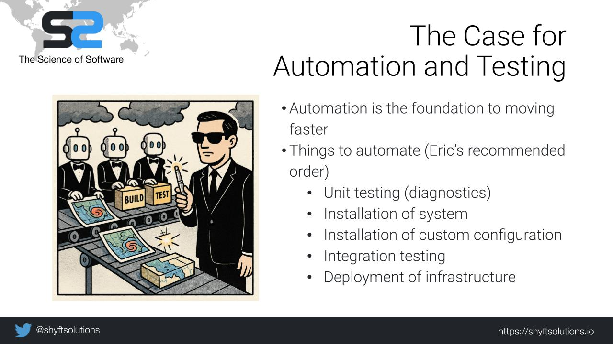
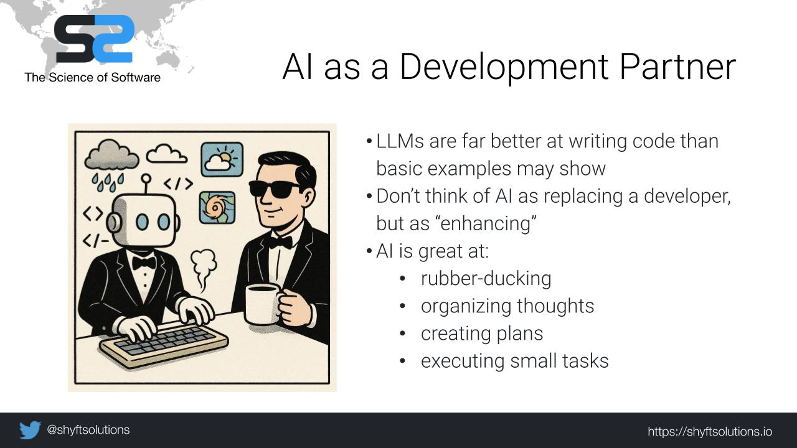
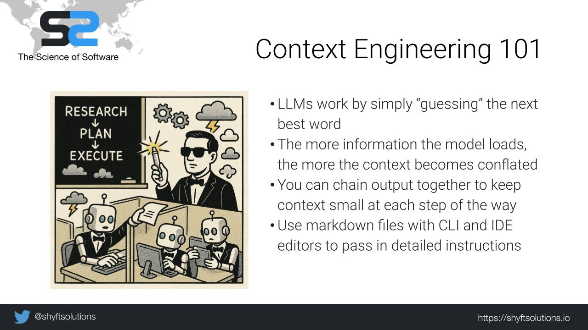
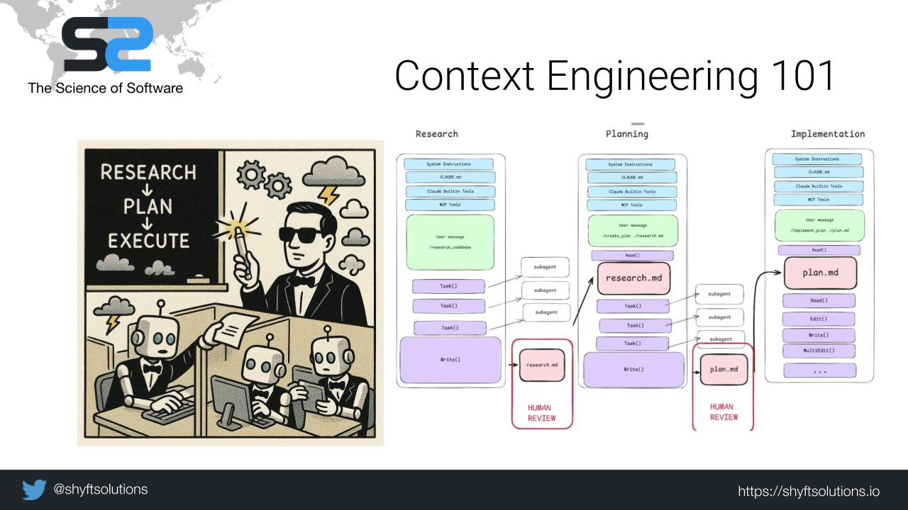
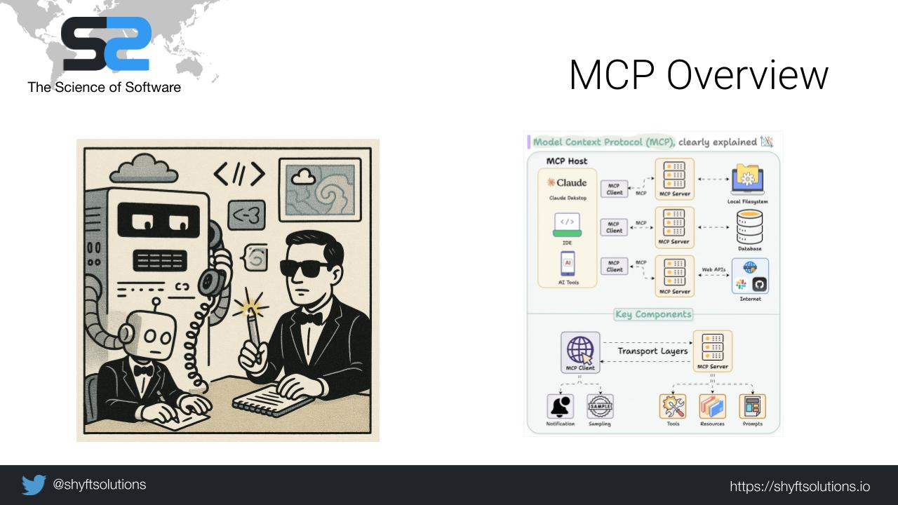
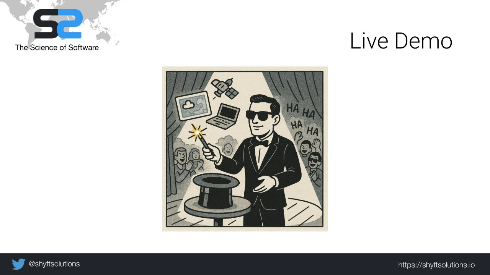

# Tomorrow's Forecast: Accelerating Innovation with AI & Smarter Context Engineering

*Shyft's 2025 IBL UGM Presentation*

This presentation explores how automation, AI agents, and context engineering can accelerate innovation in weather forecasting software. It highlights the importance of foundational automation and testing, demonstrates how AI can serve as a development partner, and shows how context engineering (and tools like MCP servers) enable smarter, faster workflows.

The talk concludes with practical demonstrations of AI-powered tools in action.

## 📑 Presentation Slides

### 1. Title Slide
**Theme:** Tomorrow's Forecast: Accelerating Innovation with AI & Smarter Context Engineering
- Introduces the metaphor of "forecasting" progress
- Teases the challenges of moving fast without automation
- Image: Agent overwhelmed typing on multiple smoking machines, robots in background ready to help

### 2. Automation & Testing
**Theme:** Foundational tools for speed
- CI/CD pipelines and automated testing are essential for rapid iteration
- Without these, progress stalls
- Image: Conveyor belt producing "Build" and "Test" boxes, robot agents assembling and zapping them

### 3. AI as a Development Partner
**Theme:** AI as a junior dev that already read all the manuals
- Helps with coding, debugging, documentation
- Smarter context = better answers
- Image: Robot agent typing at a desk, weather icons floating, human sipping coffee nearby

### 4. Context Engineering 101
**Theme:** Giving AI "just enough" information
- Process: Research → Plan → Execute
- Not about dumping everything, but shaping context for task success
- Image: Agent pointing at chalkboard flowchart "Research → Plan → Execute" with doodles of clouds/gears

### 5. MCP Overview
**Theme:** MCP as the translator/proxy
- MCP servers enable agents to interact with APIs and docs more effectively
- Acts like the "middleman communicator"
- Image: Supercomputer holding a phone receiver, talking to a robot agent at a desk

### 6. Practical Examples
**Theme:** AI in action today
- Agents exploring configs, pipelines, documentation with MCP
- Practical, not futuristic
- Image: Agent zapping a giant weather supercomputer, lightning bolts and storm icons flying out

### 7. Live Demo Setup
**Theme:** Show, don't just tell
- Demonstrate your tools working in real time
- Prove these workflows are available today
- Image: Agent magician pulling storm maps and satellites from a laptop, audience clapping

### 8. Closing / Call to Action
**Theme:** Clearer context, faster innovation
- Reinforce: Automation + Testing + AI + Context = Rapid Progress
- Encourage experimentation with these tools
- Image: Agent on a hill at sunrise, laptop projecting a forecast map, storm clouds parting

## 📂 Repository Contents

- `slides/` → Presentation slide images (renamed for clarity)
- `presentation_overview.md` → Detailed slide-by-slide breakdown
- `README.md` → This overview file

## 🎥 Additional Resources

### Video Content
*Links to YouTube videos and demonstrations will be added here*

- [ ] Presentation Recording
- [ ] Live Demo Video
- [ ] Extended Tutorial

### Related Projects & GitHub Pages
*Links to related repositories and GitHub pages will be added here*

- [ ] MCP Server Examples
- [ ] Context Engineering Toolkit
- [ ] Weather Forecasting AI Tools