# Weather Service Infrastructure - Many Things We Built

This presentation covers the comprehensive weather service infrastructure built by the team, including performance optimization, templating solutions, monitoring systems, and database architecture. The talk demonstrates practical solutions to complex infrastructure challenges and lessons learned during implementation.

---

## 📑 Slide Overview

### 1. Topics Overview
**Theme:** Introduction to presentation topics.
- Covers Shredder Performance (Cody), WMS Cloud Architecture (Cody), Templating/WMS Validation (Joe), and OED/Online Weather Demo (Jesse).
- Sets expectations for the technical depth and variety of topics to be covered.
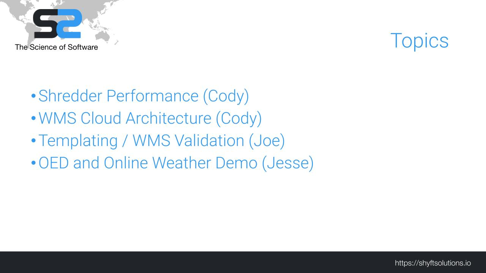

---

### 2. Shredder in the Cloud
**Theme:** Architecture of the "Shredder" system with cloud resources.
- Shows the data flow from input through Shredder Queue, Selection Compiler, to GED (Gridded Elastic Database).
- Demonstrates how shredded data fragments are processed and stored with queue management.
- Highlights potential bottlenecks that must be addressed in the system.
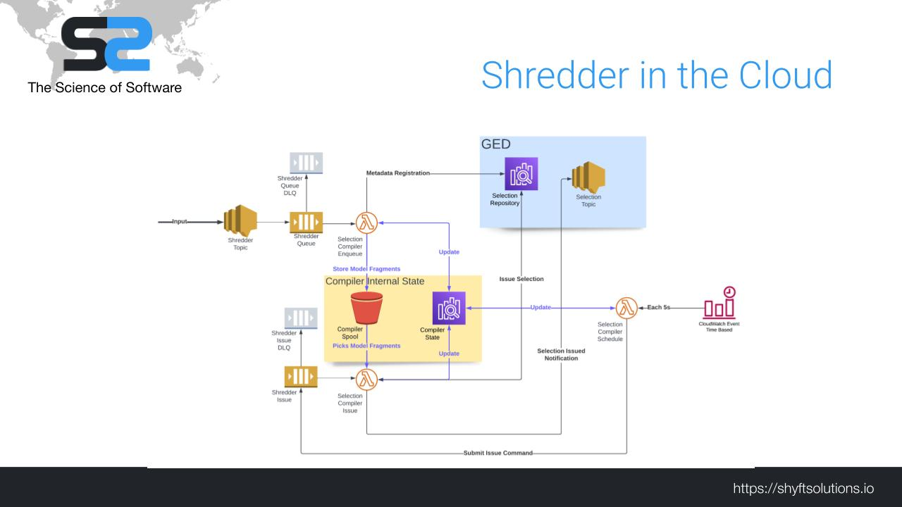

---

### 3. Performance Tweaking - Grafana + Prometheus
**Theme:** Performance optimization results using monitoring tools.
- CPU usage graph shows dramatic improvement after optimizations around 19:00.
- Key improvements: Shredder functions reduced from 3 to 1, CPU usage optimized, Memory reduced from 8GB to 3GB.
- Overall result: 50% less CPU usage, 50% less memory usage, 2-3x throughput improvement.
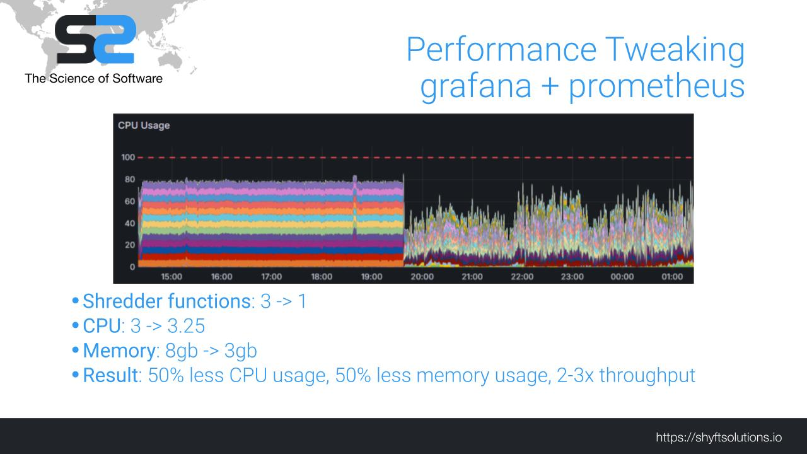

---

### 4. Metrics Logging/Visualization - Splunk
**Theme:** Monitoring capabilities using Splunk for metrics visualization.
- Shows "Visible Messages Over Time by Queue Type" with September 16th spike quickly resolved.
- Covers various queue types: dead letter queues, selection compiler queues, shredder input queues.
- Spike caused by additional data, resolved by scaling up splinter pods.
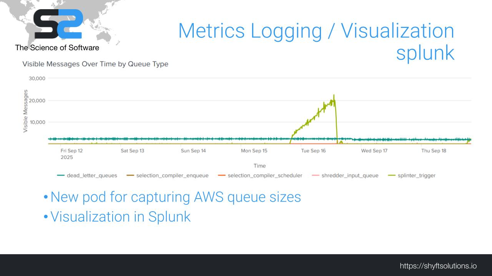

---

### 5. WMS Stitched Capabilities
**Theme:** Web Map Service stitched capabilities architecture.
- In-memory, scalable system for dynamic routing.
- User client connects through reverse proxy to combined capabilities from GFS, Radar, Satellite, and Lightning services.
- Each service has specific TTL values (2 minutes to 30 seconds).
- Enables routing GTile traffic to correct WMS pods.
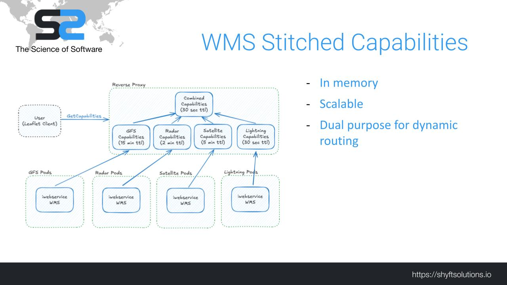

---

### 6. How Do We Manage?
**Theme:** Scope of infrastructure management.
- Dozens of models, hundreds of WMS layers (469), hundreds of WMS styles (1-8 per layer).
- Products/Spectras, Mesoscale Models, Radar sites (mosaics and single site).
- Satellites (full disk and rapid scan), Map layer products, and static products.
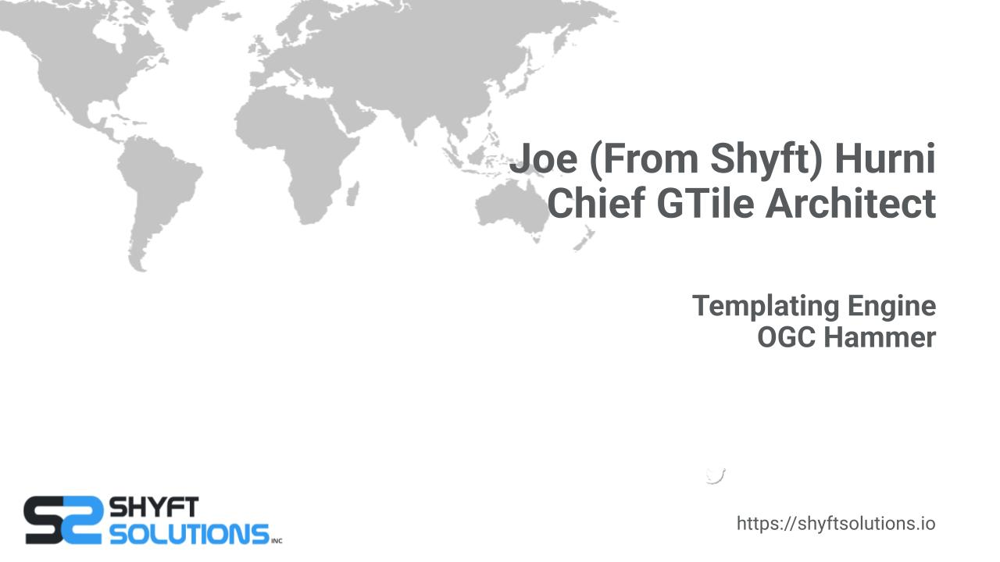

---

### 7. Templating!
**Theme:** Templating solution for managing complex infrastructure.
- Templating Engine: Python scripts using Jinja templating.
- Templating Configuration: YAML files, iwebservice stubs, and map files.
- Demonstrates weather map interface and configuration code generation.
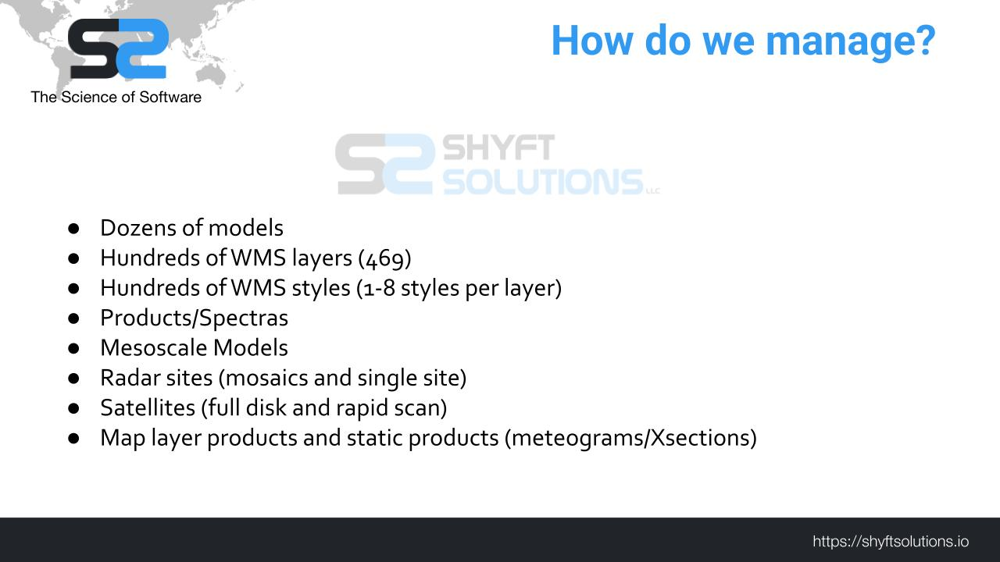

---

### 8. What This Enables
**Theme:** Benefits of the templating approach.
- Easy Model Switching: Frontend users define 'product' and toggle between models seamlessly.
- Fast Integration: Simple configuration updates add new models to hundreds of products in minutes.
- Easier Pod Breakout: Facilitates separation by Radar/Model/Geo categories.
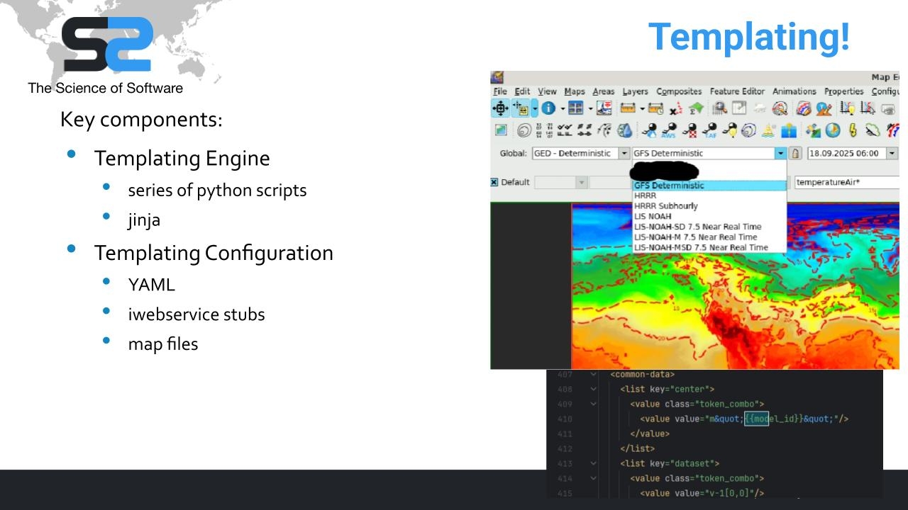

---

### 9. Problems We Encountered
**Theme:** Implementation challenges and solutions.
- Metadata Management: Manual keyword tag injection, unique WMS layer names required.
- Template Scope: Not everything should be templated - separate repositories for WMS configs and map files.
- File Path Management: Careful attention needed for layer tree structure.
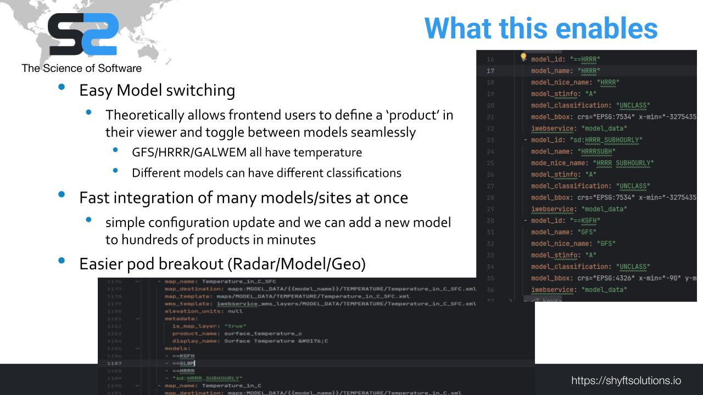

---

### 10. Problems We Encountered (Continued)
**Theme:** Additional technical challenges faced.
- Detailed code examples and configuration issues.
- Metadata became important with manual keyword injection requirements.
- Template scope decisions and implicit vs explicit considerations.
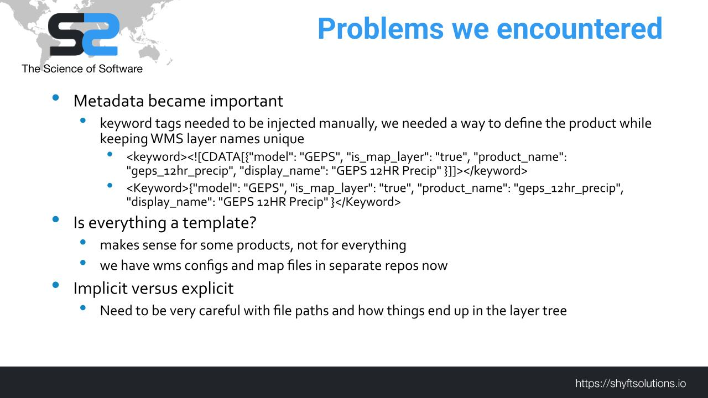

---

### 11. Future Work
**Theme:** Planned improvements and ongoing development.
- Layer tree management optimization.
- Products/spectras development expansion.
- Parameters.xml integration.
- Consolidating codebases for better maintainability.
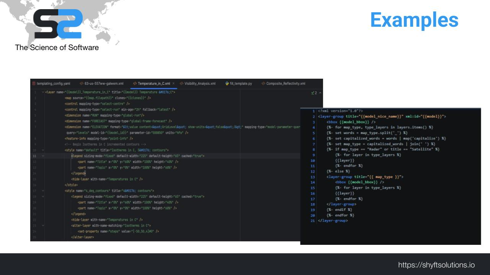

---

### 12. Examples
**Theme:** Code implementation examples.
- Practical templating system demonstrations.
- Configuration files and Python scripts showing real-world usage.
- Template generation and deployment workflows.
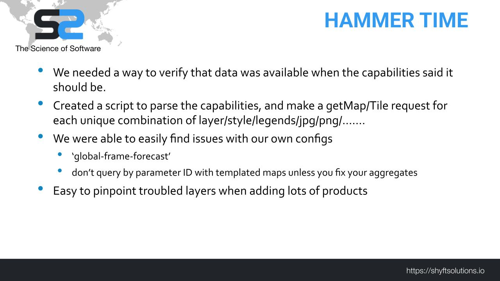

---

### 13. HAMMER TIME
**Theme:** Verification and testing approach.
- Verification system ensures data availability matches capability declarations.
- Script parses capabilities and makes getMap/getTile requests for all combinations.
- Successfully identified configuration issues including 'global-frame-forecast' problems.
- Helps pinpoint troubled layers when adding many products simultaneously.
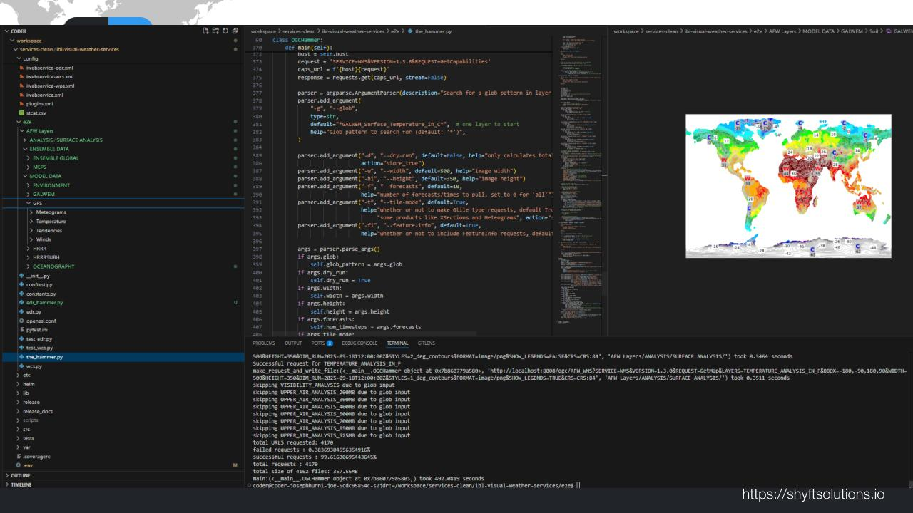

---

### 14. Object Elastic Database (OED)
**Theme:** OED architecture and integration.
- Shows integration with existing services and data flow.
- Connects upstream services (GraphQL, API) with downstream services (Visual Weather, iwebservice WMS/EDR).
- OED Copy Container manages data synchronization.
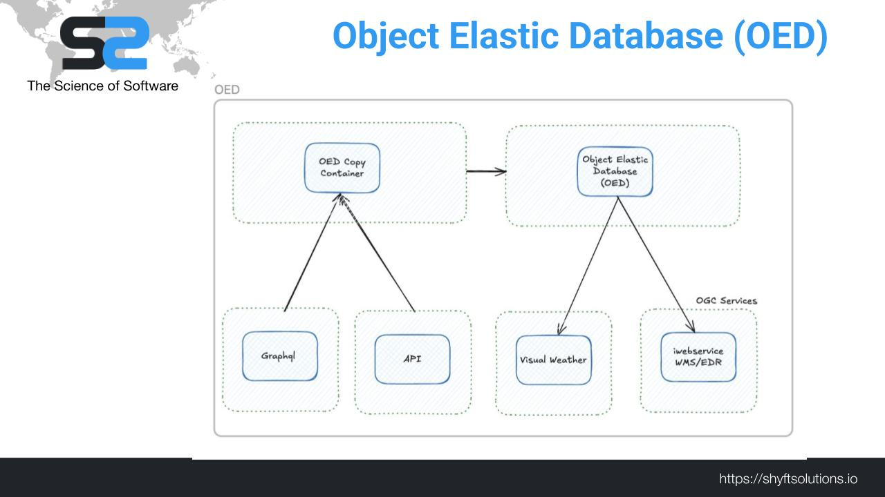

---

### 15. Object Elastic Database (OED) - Implementation Details
**Theme:** Technical implementation specifics.
- Managed using IBM's IAC (Infrastructure as Code) Tool.
- Runs isystem process every 10 minutes for new data copying.
- Addresses non-mutable dataset problems without complete data deletion.
- Enables derivation of parameters not standard in metar observations.
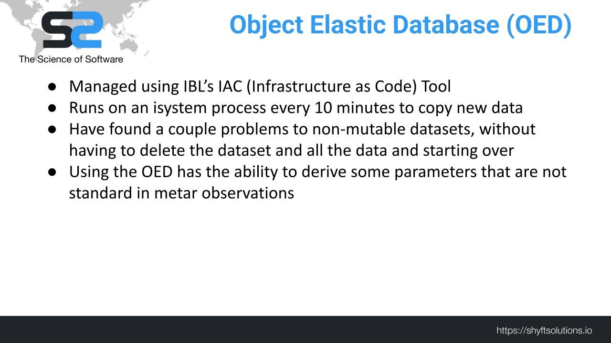

---

### 16. Object Elastic Database (OED) - Data Structure
**Theme:** Data structure and content examples.
- JSON objects with weather observation data: altimeter, dewpoint, temperature, wind measurements.
- Includes derived parameters like Theta-E and Lifted Index.
- Shows real-world meteorological data structure.
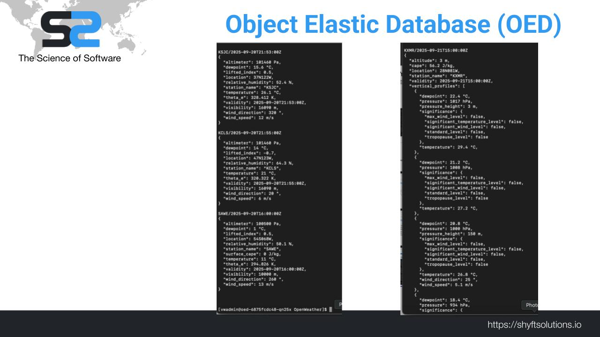

---

### 17. OED and OSA (Object Analysis Source)
**Theme:** Integration between OED and OSA in Visual Weather.
- Weather station data overlaid on topographical maps.
- Demonstrates OED data usage in conjunction with NWP model data.
- Real-world visualization of integrated weather data systems.
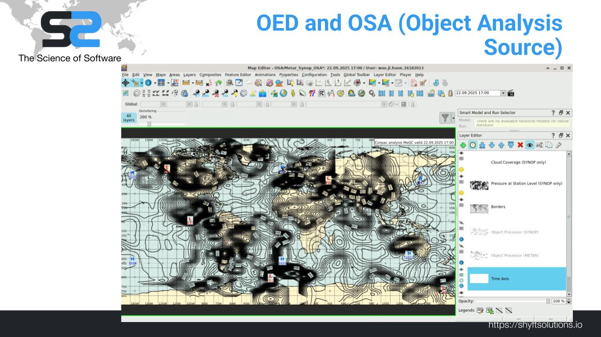

---

### 18. Online Weather
**Theme:** Online Weather system architecture.
- Simplified browser-based architecture diagram.
- Browser connects to both "Open Weather OGC Services" and "Visual Weather/Online Weather".
- Visual Weather runs processes, browser requests data from OGC services.
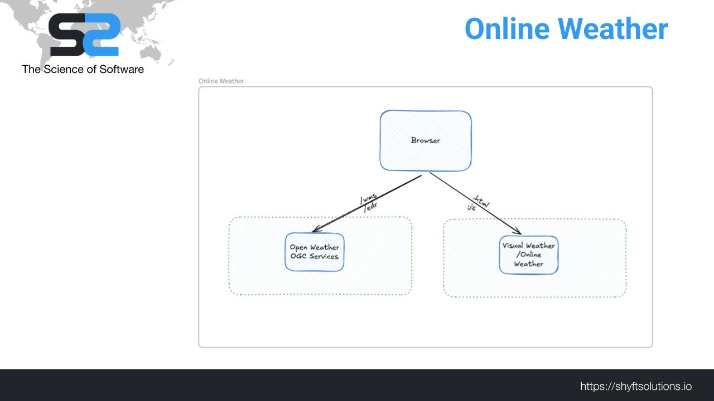

---

### 19. Online Weather Demo
**Theme:** Live demonstration preparation.
- Interactive weather visualization interface.
- Real-time data integration and display capabilities.
- User interface for weather data exploration and analysis.
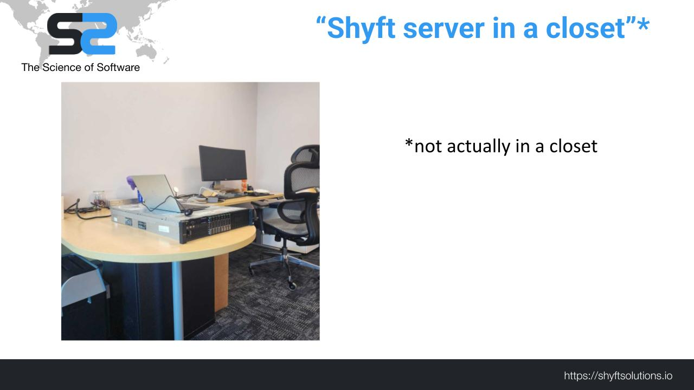

---

### 20. Demo Interface
**Theme:** User interface walkthrough.
- Weather map visualization with interactive controls.
- Layer selection, time navigation, and data overlay options.
- Integration of multiple data sources in single interface.
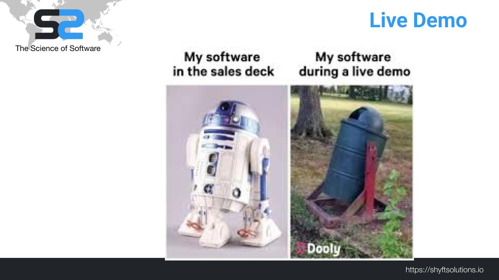

---

### 21. Questions?
**Theme:** Q&A session with humorous touch.
- "Software Engineers after giving a 30-second demo"
- Shows team members Joe and Cody in a lighthearted hospital scene.
- Acknowledges the intensity of technical presentations and demos.

---

## 📂 Repo Contents
- `slides/` → Generated images for each slide (infra-01.jpeg … infra-21.jpeg).
- `examples/` → Code snippets and configuration examples.
- `README.md` → This overview file.
- Links to tools, repositories, and further reading.